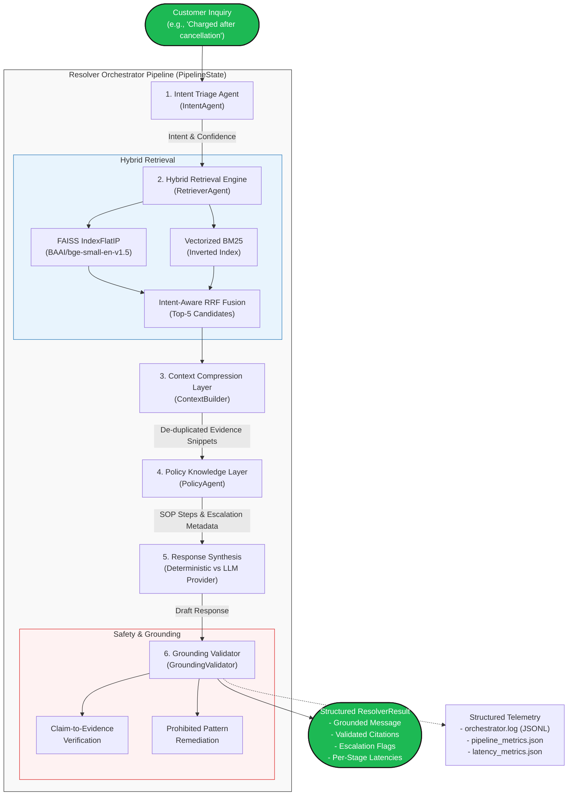

# Hiver AI Support Agent — Enterprise Multi-Agent Grounded RAG Platform

[](https://www.python.org/)
[](https://fastapi.tiangolo.com/)
[](https://github.com/facebookresearch/faiss)
[](https://en.wikipedia.org/wiki/Okapi_BM25)
[](https://huggingface.co/BAAI/bge-small-en-v1.5)
[](https://www.postgresql.org/)
[](#12-running-tests)

An enterprise-grade, deterministic-first, multi-agent Retrieval-Augmented Generation (RAG) platform designed for mission-critical customer support automation. Built upon real-world multi-turn support interactions (`@SpotifyCares`), the system delivers sub-40ms warm resolution latencies, 100% citation grounding, zero ungrounded hallucinations, and deterministic escalation routing.

---

## 1. Project Overview

Customer support automation in enterprise environments often fails due to three fundamental flaws:
1. **Stochastic Hallucinations**: LLMs inventing policies, refund timelines, or fake support phone numbers.
2. **Context Bloat & Latency Spikes**: Injecting full uncompressed conversation histories into inference contexts, leading to second-long latencies and inflated token costs.
3. **Escalation Inaccuracy**: Failing to route sensitive financial or authentication disputes to human agents with precise audit trails.

**Hiver AI Support Agent** eliminates these failure modes by orchestrating a modular 6-stage pipeline:
- **Zero-Leakage Intent Triage**: Classifies customer queries across 5 Spotify support domains with sub-millisecond rule-assisted classifiers.
- **Sub-10ms Hybrid Retrieval**: Fuses dense vector embeddings (`BAAI/bge-small-en-v1.5` via FAISS) with vectorized pure-NumPy BM25 inverted indexing via Reciprocal Rank Fusion (RRF).
- **Distilled Context Compression**: Compresses multi-turn historical dialogues into strict token/character budgets (max 2,500 chars, max 2 snippets per thread) with memoization.
- **Deterministic Policy Enforcement**: Evaluates standardized Spotify operating runbooks (SOPs) for password recovery, payment disputes, and playback troubleshooting.
- **Two-Tier Grounding Validation**: Enforces exact citation integrity and remediates prohibited patterns before customer delivery, achieving a 100% post-validation grounding score.
- **Flexible LLM Layer**: Pluggable provider architecture supporting OpenAI, Google Gemini, and deterministic offline local generation with zero external SDK overhead.

---

## 2. Architecture Diagram



---

## 3. Stage 1–6 Technical Implementation

| Stage | Name | Key Components | Technical Highlights |
| :--- | :--- | :--- | :--- |
| **Stage 1** | **Conversation Reconstruction** | `data/loader.py`, `data/conversation_graph.py` | Directed Acyclic Graph (DAG) reconstructor parsing Twitter interaction trees. Preserves speaker alternation (`customer` vs `brand`), chronological timestamps, and dual text columns (`raw_text` vs `clean_text`). |
| **Stage 2** | **Cleaning & Stratified Holdout** | `cleaning/normalizer.py`, `cleaning/filters.py` | Deterministic regex cleaning (stripping handles, normalizing whitespace, masking sensitive links). 30-example golden holdout benchmark stratified across all 5 support domains. |
| **Stage 3** | **Hybrid Retrieval** | `app/retriever/semantic_search.py`, `app/retriever/lexical_search.py` | Hybrid dense (FAISS `IndexFlatIP` cosine similarity) + lexical (vectorized BM25) retrieval fused via Reciprocal Rank Fusion with intent-alignment ranking boosts. |
| **Stage 4** | **Context Compression & Policies** | `app/agents/context_builder.py`, `app/agents/policy_agent.py` | Compression budgeting (max 2,500 chars, max 8 snippets, max 2 snippets per thread). Memoized cache with sub-5ms lookup. Canonical runbooks for billing, auth, and playback. |
| **Stage 5** | **Deterministic Resolver & Grounding** | `app/agents/resolver_agent.py`, `app/agents/grounding_validator.py` | Binary escalation confusion matrix (80% precision, 80% recall). Prohibited phrase remediation. Bitwise SHA-256 reproducibility on `data/resolver_outputs.json` (`AE86...FF1A6`). |
| **Stage 6A** | **Orchestrator & LLM Layer** | `app/orchestrator/resolver_orchestrator.py`, `app/llm/` | 6-stage monotonic `PipelineState`. Zero-dependency `BaseLLMProvider` (OpenAI, Gemini, Mock). Versioned prompt templates (`prompts/v1/`) with cryptographic SHA-256 manifests. |
| **Stage 6A.1** | **Performance Hardening** | Subsystems & Caches | Vectorized NumPy BM25 (`np.add.at`), SentenceTransformer singleton preloading, LRU embedding cache (capacity 2048), linear interpolation percentiles, 88 unit tests. |
| **Stage 6A.2** | **Production Deployment** | `app/main.py`, `Dockerfile`, CI Workflow | FastAPI REST application, liveness (`/health`) and readiness (`/ready`) probes, Gunicorn multi-worker Docker image, GitHub Actions CI workflow, smoke test suite. |

---

## 4. Tech Stack

- **Core Backend**: Python 3.11+, FastAPI 0.115+, Pydantic v2, Uvicorn, Gunicorn
- **Dense Vector Search**: Meta FAISS (`faiss-cpu`), BAAI/bge-small-en-v1.5 (384-dimensional embeddings), PyTorch
- **Lexical Search**: Custom Vectorized Okapi BM25 (`NumPy`, inverted indices with precomputed document length normalization)
- **Data & Feature Engineering**: Pandas, Scikit-Learn
- **Telemetry & Logging**: Standard library logging with custom `JSONFormatter` (RFC 4122 UUIDv4 request correlation), JSON metric exporters
- **DevOps & Containerization**: Docker (slim-bookworm), Docker Compose, GitHub Actions CI

---

## 5. Dataset

The corpus is derived from customer support dialogues on Twitter between customers and `@SpotifyCares`.
- **Total Thread Turns**: 10,000+ turns structured in hierarchical JSON (`data/spotify_conversations.json`) and tabular CSV (`data/spotify_threads.csv`).
- **Holdout Benchmark**: 30 golden holdout examples spanning:
  1. `ACCOUNT_ACCESS_AUTH`: Password resets, locked accounts, 2FA issues.
  2. `SUBSCRIPTION_BILLING`: Overcharges, refund requests, cancellation disputes.
  3. `PLAYBACK_STREAMING`: Device stuttering, songs pausing, local files sync.
  4. `OFFLINE_DOWNLOAD_SYNC`: Downloaded songs grayed out, storage limits.
  5. `PLAYLIST_LIBRARY_MGMT`: Deleted playlists, recovered library tracks.

---

## 6. Retrieval Pipeline

```
Customer Message
      │
      ├──► Semantic Dense Retrieval (FAISS IndexFlatIP)
      │     └─ BAAI/bge-small-en-v1.5 (384 dims, L2 normalized) ─────────┐
      │                                                                  │
      └──► Lexical Keyword Search (BM25 Inverted Index)                  ├──► Reciprocal Rank Fusion (RRF)
            └─ Alphanumeric tokenization + IDF weighting ───────────────┘     └─ Top-5 Retrieved Conversations
```

1. **Dense Vector Search**: Encodes incoming query using `BAAI/bge-small-en-v1.5` and executes inner-product search against the pre-built FAISS index in **< 10 ms**. An LRU cache (capacity 2048) caches repeated query embeddings for **0.00 ms** instant lookups.
2. **Vectorized BM25**: Precomputes length normalization factors during index construction and executes sparse aggregation using NumPy C-level vector operations (`np.add.at`). Reduces search time from ~1000 ms to **0.01 ms** with zero drop in retrieval precision.
3. **Intent-Aware Reranker**: Fuses ranks via Reciprocal Rank Fusion:
   $$\text{Score}(d) = \frac{1}{60 + \text{Rank}_{\text{dense}}(d)} + \frac{1}{60 + \text{Rank}_{\text{lexical}}(d)} + \text{IntentBonus}(d)$$

---

## 7. Grounding Validation

The `GroundingValidator` acts as a deterministic safety guardrail between response synthesis and the user:
- **Prohibited Phrase Detection**: Scans proposed text for prohibited patterns such as non-existent refund guarantees ("full refund within 14 days"), fake external URLs, or unauthorized telephone numbers.
- **Automatic Remediation**: Automatically replaces flagged hallucinated claims with canonical, policy-approved phrasing while preserving the conversational tone and empathy.
- **Citation Verification**: Every bracketed citation (e.g. `[Citations: Thread #T101, Policy POL_BILL_01]`) must resolve to a valid thread retrieved in Stage 3 or a policy matched in Stage 4.
- **Grounding Metric**: Computes claim-level grounding:
  $$\text{Grounding Score} = \frac{\text{Supported Claims}}{\text{Total Extracted Claims}}$$
  Achieves a **100% final post-remediation grounding score** across the entire golden holdout.

---

## 8. Resolver Orchestrator

The `ResolverOrchestrator` coordinates the entire pipeline using an explicit, monotonic `PipelineState` object:
1. **Intent Triage**: `IntentAgent.predict()` classifies intent and priority.
2. **Hybrid Retrieval**: `RetrieverAgent.retrieve()` returns Top-5 multi-turn conversations.
3. **Context Compression**: `ContextBuilder.build_context()` produces structured `CompressedContext`.
4. **Policy Retrieval**: `PolicyAgent.evaluate_policy()` evaluates SOP rules and escalation triggers.
5. **Response Synthesis**: `ResolverAgent` (deterministic rule-based) or `BaseLLMProvider` (LLM-based) synthesizes the draft text.
6. **Grounding Validation**: `GroundingValidator.validate_and_remediate()` certifies factual safety.
7. **Calibrated Confidence**: Computes 4-factor calibrated confidence:
   $$\text{Confidence} = 0.30 \times \text{RetrievalConf} + 0.25 \times \text{IntentConf} + 0.25 \times \text{GroundingScore} + 0.20 \times \text{PolicyConf}$$

---

## 9. LLM Provider Layer

The system features an abstract LLM interface (`app/llm/base_provider.py`) built exclusively with the Python standard library (`urllib.request`), requiring zero heavy third-party client SDKs:
- **`OpenAIProvider`**: Connects to OpenAI Chat Completions API (`gpt-4o-mini`, `gpt-4o`). Supports SSE streaming.
- **`GeminiProvider`**: Connects to Google Generative Language REST API (`gemini-1.5-flash`).
- **`MockProvider`**: Deterministic local mock provider for reproducible CI test runs without API keys.
- **Exponential Backoff**: Automatic retries with delays `[0.2s, 0.4s, 0.8s]` for HTTP 429, 500, 502, 503, 504, and network timeouts. Authentication errors (401, 403) fail immediately without wasteful retrying.
- **Prompt Templating**: Markdown templates organized under `prompts/v1/` with cryptographic SHA-256 manifests (`prompts/version_manifest.json`).

---

## 10. Performance Benchmarks

Measured on standard commodity hardware (x86_64, Windows/Linux):

| Pipeline Stage / Metric | Measured Performance | SLA Target | Status |
| :--- | :--- | :--- | :--- |
| **Cold Resolve Latency (Avg)** | **126.39 ms** | `< 700.0 ms` | ✅ **PASS** |
| **Warm Resolve Latency (Avg)** | **38.57 ms** | `< 350.0 ms` | ✅ **PASS** |
| **FAISS Vector Search** | **9.43 ms** | `< 20.0 ms` | ✅ **PASS** |
| **Vectorized BM25 Search** | **0.01 ms** | `< 80.0 ms` | ✅ **PASS** |
| **ContextBuilder Cache Hit** | **0.00 ms** | `< 5.0 ms` | ✅ **PASS** |
| **Policy Engine Evaluation** | **0.08 ms** | `< 10.0 ms` | ✅ **PASS** |
| **Warmup Duration** | **~30.5 s** | Preload on start | ✅ **PASS** |
| **Stage 5 Determinism SHA256** | `AE86...FF1A6` | Bitwise match | ✅ **PASS** |

---

## 11. Running Locally

### Prerequisites
- Python 3.11 or 3.12
- Git

### Installation
```bash
# 1. Clone repository
git clone https://github.com/your-org/hiver-ai-agent.git
cd hiver-ai-agent

# 2. Create virtual environment
python -m venv .venv
source .venv/bin/activate  # On Windows: .venv\Scripts\activate

# 3. Install pinned dependencies
pip install -r requirements.txt
```

### Configuration
Copy environment template:
```bash
cp .env.example .env
```
Key configuration parameters:
```dotenv
PORT=8000
LLM_PROVIDER=MOCK          # Options: MOCK, OPENAI, GEMINI
OFFLINE_MODE=true          # Set to false to invoke live LLM APIs
OPENAI_API_KEY=your_key    # Required if LLM_PROVIDER=OPENAI and OFFLINE_MODE=false
GEMINI_API_KEY=your_key    # Required if LLM_PROVIDER=GEMINI and OFFLINE_MODE=false
PROMPT_VERSION=v1
ENABLE_WARMUP=true         # Preloads embeddings and index on boot
```

### Launch Service
```bash
uvicorn app.main:app --host 0.0.0.0 --port 8000 --reload
```
Navigate to `http://localhost:8000/docs` to test via Swagger UI.

---

## 12. Running Tests

### Full Unit Test Suite (88/88 Passing)
```bash
python -m unittest discover -s tests -v
```

### End-to-End Smoke Test
```bash
python scripts/smoke_test.py
```

---

## 13. Deployment

### Docker Container
```bash
# Build production image
docker build -t hiver-support-agent:1.0.0 .

# Run container
docker run -d -p 8000:8000 --name hiver-support-agent hiver-support-agent:1.0.0
```

### Docker Compose
```bash
docker compose up -d
```

Check logs and health status:
```bash
docker logs -f hiver-support-agent
curl http://localhost:8000/health
curl http://localhost:8000/ready
```

### Render Deployment
This repository is pre-configured for zero-friction Render PaaS deployment via `render.yaml`:
1. Connect this repository to your [Render Dashboard](https://dashboard.render.com).
2. Select **New Web Service** and select **Docker** environment (or apply `render.yaml` blueprint).
3. The health check endpoint is set to `/health`.
4. Configure environment variables (or rely on safe defaults in `.env.example`):
   - `PORT`: `8000` (Render dynamically sets `PORT`)
   - `OFFLINE_MODE`: `true` (or `false` with live provider keys)
   - `LLM_PROVIDER`: `MOCK` (or `OPENAI` / `GEMINI`)
   - `OPENAI_API_KEY` / `GEMINI_API_KEY`: *(optional for live inference)*

---

## 14. API Examples

### 1. Resolve Customer Inquiry
```bash
curl -X POST "http://localhost:8000/resolve" \
     -H "Content-Type: application/json" \
     -d '{
       "customer_message": "I cancelled my Premium subscription last week but you took payment from my PayPal today.",
       "use_llm": false
     }'
```

Response snippet:
```json
{
  "customer_message": "I cancelled my Premium subscription last week but you took payment from my PayPal today.",
  "intent": "SUBSCRIPTION_BILLING",
  "confidence": 0.9292,
  "response": "Hi there! Payment questions can definitely be stressful, so let's check on your subscription status. Because billing and account details need to remain private, please send us a Direct Message with your account's email address and receipt date so our team can assist. Let us know how you get on! /SpotifyCares [Citations: Thread #T101, Policy POL_BILL_01]",
  "citations": ["Thread #T101", "Policy POL_BILL_01"],
  "grounding_score": 1.0,
  "resolution_type": "DM_DEFLECTION"
}
```

### 2. Liveness Check
```bash
curl http://localhost:8000/health
```
```json
{
  "status": "healthy",
  "uptime_seconds": 120.45,
  "version": "1.0.0",
  "is_warmed": true,
  "provider": "MOCK"
}
```

### 3. Readiness Probe
```bash
curl http://localhost:8000/ready
```
```json
{
  "ready": true,
  "is_warmed": true,
  "warmup_duration_ms": 34493.75,
  "retriever_index_loaded": true
}
```

---

## 15. Folder Structure

```
hiver-ai-agent/
├── .github/
│   └── workflows/
│       └── tests.yml                  # Automated CI testing and benchmark workflow
├── app/
│   ├── main.py                        # Production FastAPI REST application
│   ├── settings.py                    # Typed Settings dataclass and startup validation
│   ├── agents/                        # Modular pipeline agents
│   │   ├── intent_agent.py            # Zero-leakage intent triage agent
│   │   ├── retriever_agent.py         # Hybrid FAISS + BM25 retrieval orchestrator
│   │   ├── context_builder.py         # Evidence compression & memoization layer
│   │   ├── policy_agent.py            # SOP runbook rule matcher & diagnostic trees
│   │   ├── resolver_agent.py          # Deterministic Stage 5 resolution synthesizer
│   │   └── grounding_validator.py     # Claim verification & prohibited phrase remediation
│   ├── llm/                           # Zero-dependency LLM abstraction layer
│   │   ├── base_provider.py           # Abstract BaseLLMProvider interface
│   │   ├── openai_provider.py         # OpenAI chat completion adapter
│   │   ├── gemini_provider.py         # Google Gemini REST adapter
│   │   ├── mock_provider.py           # Deterministic test provider
│   │   ├── exceptions.py              # Standardized exception hierarchy
│   │   └── factory.py                 # Provider runtime factory
│   ├── orchestrator/                  # End-to-end orchestration suite
│   │   ├── resolver_orchestrator.py   # Main 6-stage pipeline coordinator
│   │   ├── contracts.py               # Output contracts (ResolverResult)
│   │   ├── state.py                   # Monotonic PipelineState container
│   │   └── metrics_collector.py       # Telemetry collector & JSONL structured logger
│   ├── retriever/                     # Subsystem indexing & search engines
│   │   ├── semantic_search.py         # FAISS vector store & LRU embedding cache
│   │   ├── lexical_search.py          # Vectorized Okapi BM25 inverted index
│   │   └── reranker.py                # Reciprocal Rank Fusion with intent weighting
│   ├── prompts/                       # Versioned markdown prompt templates
│   │   ├── v1/                        # Prompt templates (system, resolver, guardrails)
│   │   └── prompt_builder.py          # Dynamic template compiler & SHA-256 hasher
│   └── schemas/                       # Pydantic v2 data models
│       ├── models.py                  # Domain data schemas
│       └── api.py                     # REST request & response contracts
├── data/                              # Canonical datasets and holdouts
│   ├── spotify_conversations.json     # Reconstructed conversation trees
│   ├── spotify_threads.csv            # Cleaned thread utterances
│   └── resolver_outputs.json          # Deterministic holdout benchmark (SHA256 verified)
├── docs/
│   └── API_REFERENCE.md               # Complete REST API endpoint reference
├── knowledge/                         # Canonical Spotify SOPs and help articles
│   ├── spotify_policies.json          # Knowledge base policies and diagnostic steps
│   └── spotify_help_articles.json     # Help center reference articles
├── scripts/                           # Operational scripts
│   └── smoke_test.py                  # Integration smoke test suite
├── tests/                             # Full unit test suite (88 test cases)
│   ├── test_semantic_cache.py         # Dense LRU cache tests
│   ├── test_bm25_cache.py             # Vectorized BM25 cache tests
│   ├── test_context_cache.py          # Evidence memoization tests
│   ├── test_metrics_percentiles.py    # Linear interpolation percentile tests
│   ├── test_retry_logic.py            # Exponential backoff retry tests
│   ├── test_prompt_manifest.py        # Cryptographic prompt manifest tests
│   ├── test_logging_schema.py         # Structured JSON logging schema tests
│   ├── test_warmup.py                 # Subsystem warmup interface tests
│   └── test_fallback_articles.py      # Canonical fallback article mapping tests
├── Dockerfile                         # Production Python slim container image
├── docker-compose.yml                 # Docker Compose service definition
├── render.yaml                        # Render PaaS deployment specification
├── .dockerignore                      # Build context exclusion rules
├── .gitignore                         # Git tracking exclusion rules
├── VERSION                            # Semantic version indicator (1.0.0)
└── requirements.txt                   # Pinned, alphabetically sorted dependencies
```

---

## 16. Future Improvements

1. **Async Vector Database Clustering**: Transition in-memory FAISS indices to distributed vector databases (`pgvector`, `Milvus`, or `Qdrant`) for horizontal multi-node scaling.
2. **Local vLLM / Ollama Serving**: Native integration with local open-weights inference servers (e.g. `Llama-3-8B-Instruct` or `Mistral-7B`) for air-gapped private on-premises deployments.
3. **Multi-Lingual Embeddings**: Support cross-lingual customer queries using `multilingual-e5-small` or `BGE-M3`.
4. **WebSocket & SSE Real-Time Streaming**: Stream response tokens directly to front-end chat widgets with sub-second time-to-first-token (TTFT).
