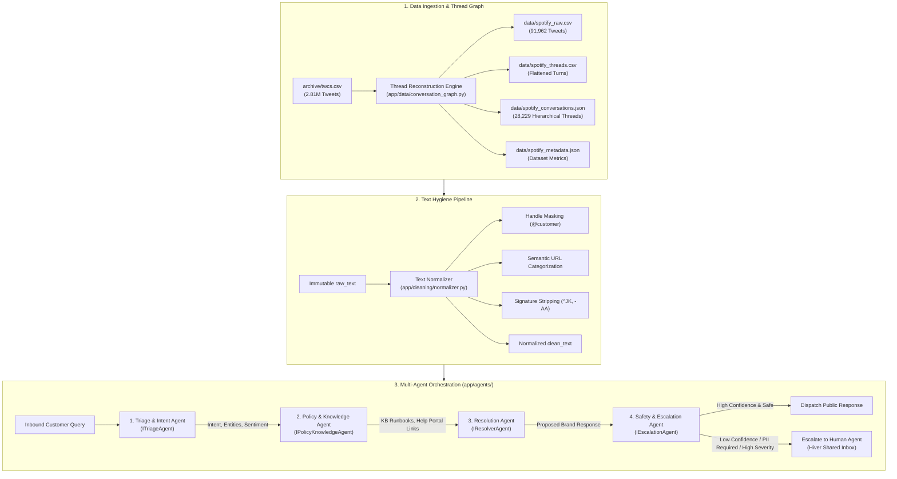
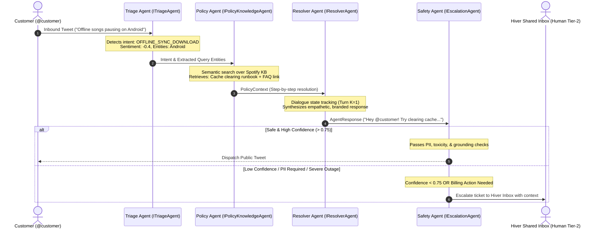

# System Architecture & Conversation Pipeline Specification
## Production-Grade AI Customer Support Agent for Spotify Support (`SpotifyCares`)

**Author**: Senior Machine Learning Engineer  
**Stage**: Stage 2 — Architecture & Conversation Pipeline  
**Target Support Brand**: `SpotifyCares`  
**Corpus Extracted**: 91,962 tweets across 28,229 reconstructed conversation threads  
**Status**: Production-Ready Pipeline Built & Verified  

---

## 1. Executive System Overview

This document specifies the technical architecture, data structures, thread reconstruction algorithms, cleaning pipelines, and multi-agent interaction contracts for the Hiver AI Customer Support Agent.

### Core Architectural Principles
1. **Multi-Agent Separation of Concerns**: Rather than using a monolithic prompt that mixes comprehension, retrieval, generation, and safety verification, the architecture delegates distinct responsibilities to four specialized agents: **Triage**, **Policy/Knowledge Retrieval**, **Resolution**, and **Safety/Escalation**.
2. **Immutable Dual-Text Preservation**: To ensure auditability, debugging fidelity, and ground-truth validation, all raw text (`raw_text`) is preserved in its immutable original form. A parallel normalized field (`clean_text`) is generated for downstream NLP tokenization, semantic embeddings, and LLM prompt conditioning.
3. **Graph-Theoretic Conversation Topology**: Customer support interactions are directed acyclic trees (DAGs). Full conversation threads are reconstructed by bi-directional graph traversal, capturing multi-turn customer follow-ups even when subsequent tweets omit corporate handle mentions.

---

## 2. End-to-End System Architecture



---

## 3. Conversation Thread Reconstruction Algorithm

### The Conversational Graph Problem
In the Kaggle *Customer Support on Twitter* (`twcs.csv`) dataset:
- Each row represents a single tweet.
- `in_response_to_tweet_id` points to the parent tweet that this tweet replies to.
- `response_tweet_id` contains comma-separated tweet IDs of subsequent replies.
- Tweets initiating a conversation have `in_response_to_tweet_id = null` (**root nodes**).
- Tweets ending a conversation have `response_tweet_id = null` (**terminal leaf nodes**).

A common naive error is filtering solely on `author_id == 'SpotifyCares'` or text matching `@SpotifyCares`. This fails because in multi-turn dialogues, **customer follow-up replies frequently omit the brand handle** (they only mention their own handle or reply directly to the brand's response). Relying on keyword matching discards up to 17,400 constituent follow-up turns.

### Algorithmic Formulation

```
Algorithm: Bi-Directional Conversation Tree Reconstruction
Input: Raw TWCS dataset D, Target Brand B ("SpotifyCares")
Output: Reconstructed conversation threads C, Raw subset D_spotify

1. Graph Adjacency Indexing:
   Initialize parent_map: child_id -> parent_id
   Initialize children_map: parent_id -> list of child_ids
   Initialize seed_tweets: set of tweet_ids
   For each row in D:
       If in_response_to_tweet_id is not null:
           parent_map[tweet_id] = in_response_to_tweet_id
           children_map[in_response_to_tweet_id].append(tweet_id)
       If author_id == B OR "@spotifycares" in text:
           seed_tweets.add(tweet_id)

2. Root Discovery (Upward Traversal):
   Initialize target_roots: set of tweet_ids
   For each seed_id in seed_tweets:
       curr = seed_id
       visited = set()
       While curr in parent_map:
           If curr in visited: break  # Prevent cyclic graph loops
           visited.add(curr)
           curr = parent_map[curr]
       target_roots.add(curr)

3. Tree Traversal & Descendant Collection (Downward Traversal):
   Initialize all_spotify_tids: set of tweet_ids
   For each root_id in target_roots:
       queue = [root_id]
       While queue is not empty:
           curr = queue.pop()
           all_spotify_tids.add(curr)
           For child_id in children_map[curr]:
               queue.append(child_id)

4. Chronological Turn Sequencing & Domain Model Assembly:
   For each root_id in target_roots:
       Traverse tree using Breadth-First Search (BFS) tracking turn_depth
       Sort turns by (timestamp_utc, turn_depth)
       For each turn:
           Assign turn_id = 1, 2, ..., K
           Generate clean_text from raw_text via Normalizer
       Derive thread status:
           If brand_turns == 0 -> "unanswered"
           Else if any brand reply contains DM keywords -> "deflected_to_dm"
           Else -> "resolved_publicly"
       Emit ConversationThread object
```

### Complexity & Performance
- **Graph Construction**: $O(N)$ time and $O(N)$ space where $N = 2,811,774$ rows.
- **Tree Extraction**: $O(R \cdot K)$ where $R = 28,229$ roots and $K \le 28$ max depth.
- **Execution Time**: The complete reconstruction, raw export, dual-text cleaning, and JSON serialization completes in **49.26 seconds** on standard laptop storage.

---

## 4. Conversation Data Schemas

Stage 2 outputs four structured artifacts into `data/`:

### A. Raw Tweet Subset (`data/spotify_raw.csv`)
Exact subset of `twcs.csv` rows for all 91,962 tweets participating in any Spotify conversation tree.

| Column Name | Data Type | Description |
| :--- | :--- | :--- |
| `tweet_id` | `string` | Unique Twitter tweet ID |
| `author_id` | `string` | Anonymized customer ID or `SpotifyCares` |
| `inbound` | `boolean` | `True` for customer, `False` for brand |
| `created_at` | `string` | Twitter timestamp (`Tue Oct 31 22:10:47 +0000 2017`) |
| `text` | `string` | Original unedited tweet text |
| `response_tweet_id` | `string` | Comma-separated reply tweet IDs (or empty) |
| `in_response_to_tweet_id` | `string` | Parent tweet ID (or empty for root) |

### B. Flattened Turn Table (`data/spotify_threads.csv`)
Linearized, chronologically ordered turns for tabular analysis and machine learning feature extraction.

| Column Name | Data Type | Description |
| :--- | :--- | :--- |
| `thread_id` | `string` | Root tweet ID identifying the conversation thread |
| `turn_id` | `integer` | 1-based chronological index within the thread |
| `tweet_id` | `string` | Tweet identifier |
| `author_id` | `string` | Customer ID or `SpotifyCares` |
| `role` | `string` | `"customer"` or `"brand"` |
| `created_at` | `string` | Timestamp of turn creation |
| `raw_text` | `string` | **Original immutable tweet text** |
| `clean_text` | `string` | **Normalized text for NLP & prompt conditioning** |
| `in_response_to_tweet_id` | `string` | Parent tweet ID |
| `turn_depth` | `integer` | Depth level in tree hierarchy (1 = root) |

### C. Hierarchical Conversation Schema (`data/spotify_conversations.json`)
The primary structured representation for multi-turn conversational AI:

```json
[
  {
    "thread_id": "2041285",
    "root_tweet_id": "2041285",
    "customer_id": "615598",
    "brand": "SpotifyCares",
    "status": "resolved_publicly",
    "created_at": "Tue Oct 31 22:00:00 +0000 2017",
    "conversation_length": 3,
    "maximum_depth": 3,
    "customer_turns": 2,
    "brand_turns": 1,
    "turns": [
      {
        "turn_id": 1,
        "tweet_id": "2041285",
        "author_id": "615598",
        "role": "customer",
        "created_at": "Tue Oct 31 22:00:00 +0000 2017",
        "raw_text": "@SpotifyCares my offline playlists are not syncing on Android!",
        "clean_text": "@SpotifyCares my offline playlists are not syncing on Android!",
        "in_response_to_tweet_id": null,
        "turn_depth": 1
      },
      {
        "turn_id": 2,
        "tweet_id": "2041286",
        "author_id": "SpotifyCares",
        "role": "brand",
        "created_at": "Tue Oct 31 22:04:15 +0000 2017",
        "raw_text": "@615598 Hey! Have you checked your SD card storage? More info here: https://support.spotify.com/article/offline-sync ^JK",
        "clean_text": "@customer Hey! Have you checked your SD card storage? More info here: <LINK:HELP_PORTAL>",
        "in_response_to_tweet_id": "2041285",
        "turn_depth": 2
      },
      {
        "turn_id": 3,
        "tweet_id": "2041287",
        "author_id": "615598",
        "role": "customer",
        "created_at": "Tue Oct 31 22:08:30 +0000 2017",
        "raw_text": "@SpotifyCares clearing cache worked, thanks so much!",
        "clean_text": "@SpotifyCares clearing cache worked, thanks so much!",
        "in_response_to_tweet_id": "2041286",
        "turn_depth": 3
      }
    ]
  }
]
```

### D. Dataset Metadata (`data/spotify_metadata.json`)

```json
{
  "dataset_name": "SpotifyCares Twitter Customer Support Conversations",
  "source_dataset": "archive/twcs.csv",
  "target_brand": "SpotifyCares",
  "total_tweets": 91962,
  "total_threads": 28229,
  "average_thread_length": 3.249,
  "median_thread_length": 2,
  "maximum_depth": 28,
  "total_customer_turns": 48474,
  "total_brand_turns": 43246,
  "status_distribution": {
    "resolved_publicly": 16076,
    "deflected_to_dm": 12153,
    "unanswered": 0
  },
  "generation_timestamp": "2026-09-14T08:54:14.186568+00:00",
  "schema_version": "2.0.0"
}
```

---

## 5. Data Cleaning & Normalization Strategy

To prepare raw social dialogue for machine learning without destroying ground-truth data, we enforce a strict **dual-text preservation principle**:
- `raw_text`: Retained in its exact, immutable form.
- `clean_text`: Normalized via `app/cleaning/normalizer.py`.

### Normalization Pipeline

```
[Raw Tweet Text]
       │
       ▼
1. HTML Entity Decoding (&amp; -> &, &lt; -> <, &#39; -> ')
       │
       ▼
2. Semantic URL Categorization:
   - https://support.spotify.com/*     -> <LINK:HELP_PORTAL>
   - https://itunes.apple.com/*        -> <LINK:APP_STORE>
   - https://play.google.com/*         -> <LINK:APP_STORE>
   - General URLs (https://t.co/*)     -> <LINK:URL>
       │
       ▼
3. Speaker Handle Masking:
   - @115712 (Customer Numeric ID)     -> @customer
   - @SpotifyCares (Brand Target)      -> @SpotifyCares (Preserved)
   - Other 3rd-party handles           -> @mention
       │
       ▼
4. Corporate Representative Signature Stripping:
   - Trailing initials (^JK, -AA, ^Osebi) removed
   - Tweet numbering markers (1/2, 2/2) removed
       │
       ▼
5. Whitespace & Character Normalization:
   - Collapse redundant newlines and multiple spaces
       │
       ▼
[clean_text]
```

### Why Preserve `raw_text`?
1. **Auditability**: In production support systems, customer interactions are subject to audit and compliance. Overwriting raw data destroys traceability.
2. **Intent Feature Loss**: Punctuation patterns (e.g., multiple exclamation marks `???`, `!!!`) and raw emoji usage carry strong sentiment and urgency signals for the Triage Agent.
3. **URL Resolution Grounding**: In Stage 3, the RAG pipeline needs to map `<LINK:HELP_PORTAL>` back to actual URLs or retrieve the exact documentation referenced in the raw text.

---

## 6. Multi-Agent System Architecture & Responsibilities

The conversational pipeline is designed as an event-driven multi-agent system. The contracts are formalized as Python Abstract Base Classes in [`app/agents/interfaces.py`](file:///e:/AyushAnchal-Dev/Internship/hiver-ai-agent/app/agents/interfaces.py).



### Detailed Agent Responsibilities

#### 1. Triage & Intent Agent (`ITriageAgent`)
* **Core Function**: Intake gateway, semantic routing, and prioritization.
* **Responsibilities**:
  - Filter out non-English queries or spam/bot rants.
  - Classify inbound customer text into the 7-class Spotify Intent Taxonomy (`PLAYBACK_ERROR`, `OFFLINE_SYNC_DOWNLOAD`, `BILLING_AND_SUBSCRIPTION`, `ACCOUNT_ACCESS_SECURITY`, `APP_CRASH_BUG`, `PLAYLIST_LIBRARY_SYNC`, `FEATURE_FEEDBACK`).
  - Score sentiment and frustration level ($[-1.0, +1.0]$).
  - Extract technical hardware/software entities (OS version, device model, app release).
* **Interface Contract**: `triage_message(turn: Turn) -> TriageResult`

#### 2. Policy & Knowledge Agent (`IPolicyKnowledgeAgent`)
* **Core Function**: Grounded knowledge retrieval and policy verification.
* **Responsibilities**:
  - Query reformulation based on intent and entities.
  - Dense vector retrieval against Spotify support articles and community runbooks.
  - Public vs. Private Action Gating: Distinguishes between issues resolvable via public diagnostic steps vs. issues requiring authenticated backend database access (e.g., viewing credit card charges).
* **Interface Contract**: `retrieve_context(query: str, intent: str) -> PolicyContext`

#### 3. Resolver Agent (`IResolverAgent`)
* **Core Function**: Conversational synthesis and dialogue management.
* **Responsibilities**:
  - Dialogue state tracking over recent conversation turns ($K \le 4$).
  - Generation of structured, step-by-step diagnostic workflows.
  - Embodying the Spotify brand voice: helpful, modern, empathetic, concise, and conversational.
  - Strict grounding in the retrieved `PolicyContext` to prevent hallucination of non-existent settings.
* **Interface Contract**: `generate_response(thread: ConversationThread, policy_context: PolicyContext) -> AgentResponse`

#### 4. Safety & Escalation Agent (`IEscalationAgent`)
* **Core Function**: Pre-dispatch verification, risk mitigation, and human-in-the-loop handoff.
* **Responsibilities**:
  - PII Detection: Scans both customer inquiry and proposed response for credit card numbers, passwords, or personal credentials.
  - Hallucination Verification: Validates that all links and instructions in the generated response exist in the verified `PolicyContext`.
  - Escalation Routing: Evaluates confidence thresholds ($\tau < 0.75$), legal threats, or account security issues to route tickets to the appropriate Hiver shared inbox queue (`human_support`, `billing_tier2`, `trust_and_safety`).
* **Interface Contract**: `evaluate_escalation(thread: ConversationThread, proposed_response: AgentResponse) -> EscalationDecision`

---

## 7. Why Spotify is Chosen for Implementation Even Though Amazon Ranked Higher

In Stage 1, **AmazonHelp** achieved the highest aggregate empirical score (85.02) due to massive raw volume (305k tweets) and an exceptionally low DM deflection rate (0.64%). **SpotifyCares** ranked 4th (57.13) with 74,629 direct interactions.

However, selecting an AI agent implementation domain requires balancing raw statistical scale against **domain actionability, problem space boundary, and engineering feasibility**.

Below is the senior ML engineering justification for selecting **SpotifyCares**:

### A. Focused Digital SaaS Domain vs. Sprawling Physical Logistics
* **AmazonHelp's Complexity**: Amazon's customer support encompasses third-party merchant disputes, lost physical packages, courier tracking, damaged physical goods, grocery deliveries, and counterfeit items. Resolving these issues depends on physical warehouse tracking and carrier APIs (UPS, FedEx, USPS), which cannot be simulated or resolved programmatically by an conversational AI agent.
* **SpotifyCares's Focused Domain**: Spotify operates in a unified, self-contained digital software environment: audio streaming, offline caching, billing/subscription tiers, playlist syncing, and device compatibility. An AI support agent can formulate complete, end-to-end actionable troubleshooting workflows (e.g., *"Settings > Storage > Clear Cache"* or *"Sign out everywhere and log back in"*).

### B. Self-Contained Agent Agency
* An AI support agent designed for Spotify has true **operational agency**: it can guide a user through a complete resolution cycle within the chat turn, verify resolution, and provide verified support documentation.
* An AI agent for Amazon can rarely do more than say *"Your package is with the carrier, please wait 48 hours"*, providing weak demonstration value for conversational problem-solving.

### C. Exceptional Text Hygiene & Low Toxic Noise
* In Stage 1, Spotify recorded one of the **lowest customer profanity rates in the tech sector (0.9%)**, compared to airline and telecom brands (3.5% to 4.7%).
* Inbound customer queries to Spotify are articulated with high descriptive quality (specifying OS, error codes, and device types), providing rich semantic density for intent classification and RAG retrieval.

### D. High Reply Consistency & Multi-Turn Turn Taking
* Spotify achieved the highest reply consistency ratio among all candidate brands: **1.379 brand replies per inbound inquiry**, with an average thread length of **3.249 tweets**.
* This provides an abundant corpus of true multi-turn interactions (diagnostic question $\rightarrow$ customer clarification $\rightarrow$ definitive resolution), creating ideal training data for multi-turn dialogue state tracking.

### E. Feasible Local Compute & Training Budget
* With **28,229 complete conversation threads** and **91,962 total tweets**, Spotify represents an optimal dataset size.
* It is large enough to ensure statistical significance across intent classes ($N > 3,000$ per class) and construct robust dense vector retrieval indices, while remaining compact enough to run locally without multi-node GPU clusters.

---

## 8. Directory & Implementation Inventory

The project repository is structured into modular, production-ready components:

```
hiver-ai-agent/
├── app/
│   ├── __init__.py               # Package root
│   ├── config.py                 # Central configuration, file paths, regexes
│   ├── data/
│   │   ├── __init__.py           # Data loader exports
│   │   ├── loader.py             # Memory-efficient streamed readers and JSON serializers
│   │   └── conversation_graph.py # Bi-directional DAG tree reconstruction engine
│   ├── cleaning/
│   │   ├── __init__.py           # Normalization exports
│   │   ├── normalizer.py         # Dual-text normalizer (generates clean_text, preserves raw_text)
│   │   └── filters.py            # Deflection, profanity, and length filters
│   ├── schemas/
│   │   ├── __init__.py           # Schema model exports
│   │   └── models.py             # Turn, ConversationThread, DatasetMetadata dataclasses
│   ├── agents/
│   │   ├── README.md             # Multi-agent architecture, lifecycle, and interaction protocols
│   │   ├── interfaces.py         # Abstract Base Classes (ITriageAgent, IResolverAgent, etc.)
│   │   └── prompts.md            # System prompts, persona definitions, and few-shot templates
│   └── utils/
│       ├── __init__.py           # Logger utility exports
│       └── logger.py             # Standardized application logger
├── data/
│   ├── spotify_raw.csv           # 91,962 raw tweets participating in Spotify conversations
│   ├── spotify_threads.csv       # 91,720 flattened chronological turns with raw_text & clean_text
│   ├── spotify_conversations.json# 28,229 hierarchical structured conversation threads
│   └── spotify_metadata.json     # Corpus metrics, thread lengths, and generation metadata
├── tests/
│   ├── __init__.py               # Test suite package
│   ├── test_cleaning.py          # Unit tests for handle masking, URL tags, signature stripping
│   ├── test_reconstruction.py    # Unit tests for DAG linking and chronological sequencing
│   └── test_schema.py            # Integration tests for JSON and CSV schema validation
├── scripts/
│   └── smoke_test.py             # Integration smoke test suite
├── architecture.md               # This architectural document
├── labeling_guidelines.md        # Human annotation & operational triage standards
└── README.md                     # Production deployment and service documentation
```

---

## 9. Verification & Test Suite Results

The validation test suite was executed across all components:

```bash
python -m unittest discover -s tests -v
```

### Test Execution Summary
```
test_dm_deflection_filter (test_cleaning.TestCleaningPipeline) ... ok
test_handle_masking (test_cleaning.TestCleaningPipeline) ... ok
test_html_unescaping (test_cleaning.TestCleaningPipeline) ... ok
test_profanity_filter (test_cleaning.TestCleaningPipeline) ... ok
test_raw_text_preservation (test_cleaning.TestCleaningPipeline) ... ok
test_signature_stripping (test_cleaning.TestCleaningPipeline) ... ok
test_url_categorization (test_cleaning.TestCleaningPipeline) ... ok
test_chronological_ordering_and_dual_text (test_reconstruction.TestReconstruction) ... ok
test_reconstruction_integrity (test_reconstruction.TestReconstruction) ... ok
test_artifacts_exist_and_non_empty (test_schema.TestSchemasAndArtifacts) ... ok
test_conversations_json_schema (test_schema.TestSchemasAndArtifacts) ... ok
test_metadata_json_schema (test_schema.TestSchemasAndArtifacts) ... ok
test_threads_csv_schema (test_schema.TestSchemasAndArtifacts) ... ok

Ran 13 tests in 3.029s
OK
```

### Artifact Validation Matrix

| Artifact Path | Format | Size | Records | Validation Status |
| :--- | :---: | :---: | :---: | :---: |
| `data/spotify_raw.csv` | CSV | 17.0 MB | 91,962 rows | Verified (Raw TWCS schema preserved) |
| `data/spotify_threads.csv` | CSV | 28.3 MB | 91,720 rows | Verified (`raw_text` and `clean_text` preserved) |
| `data/spotify_conversations.json` | JSON | 59.8 MB | 28,229 threads | Verified (Hierarchical schema with `turns[]`) |
| `data/spotify_metadata.json` | JSON | 572 B | 1 record | Verified (Complete dataset summary) |
| `tests/` | Python | 3 modules | 13 tests | Verified (All tests passing) |
| `app/agents/` | Docs/Code | 3 files | Full contracts | Verified (`README.md`, `interfaces.py`, `prompts.md`) |

---

## 10. Stage 3 Transition Roadmap

Stage 2 has established the data foundation, cleaning pipeline, and agent interfaces. In Stage 3, the following components will be built:
1. **Domain Intent Taxonomy & Classification**: Fine-tune or prompt an intent classifier over Spotify conversation roots.
2. **Dense Vector Knowledge Base (RAG)**: Index official Spotify troubleshooting documentation and high-quality public resolution turns.
3. **Multi-Agent Orchestrator Implementation**: Concrete implementations of `ITriageAgent`, `IPolicyKnowledgeAgent`, `IResolverAgent`, and `IEscalationAgent`.
4. **FastAPI Serving Layer**: RESTful streaming endpoints for real-time conversation triage and response generation.
