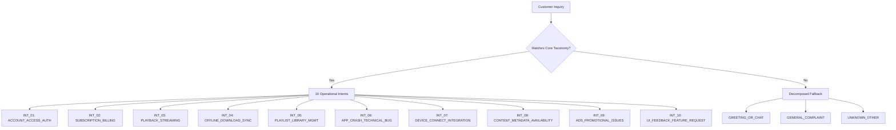
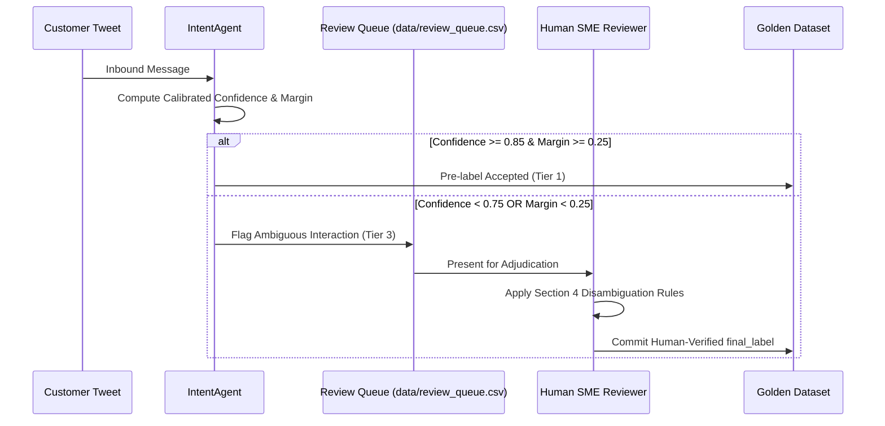

# Human Annotation & Triage Labeling Guidelines
## Operational Annotation Standard for Spotify Customer Support (`@SpotifyCares`)

**Document Version**: 1.1.0 (Production Release)  
**Target Brand**: `SpotifyCares` (Kaggle Twitter Customer Support Dataset)  
**Primary Audience**: Human Reviewers, SME Annotators, ML Engineers  
**Governing Principle**: Every customer inquiry is **AI pre-labeled, pending human verification**. All ambiguous or borderline interactions are quarantined in `data/review_queue.csv` for human adjudication.

---

## 1. Annotation Principles & Philosophy

1. **Root Cause Over Superficial Keywords**: Classify according to the customer's *underlying functional blocker*, not incidental terminology. If a customer writes *"I can't play songs because Spotify says my password expired"*, the blocker is authentication (`ACCOUNT_ACCESS_AUTH`), not playback streaming.
2. **Actionable Resolution Routing**: Assign the intent that directs the ticket to the specialized resolution agent or support workflow equipped to resolve the issue (e.g., billing disputes to financial agents, crash logs to mobile engineering).
3. **Strict Dual-Label Prohibition**: Every interaction in the golden evaluation set must be resolved to a single, unambiguous `final_label`. When multi-intent friction occurs, apply the **Priority Hierarchy** (Section 4).
4. **Preservation of Raw Utterances**: Never alter, truncate, or normalize the customer's original text when reviewing. Rely on dual-text representations (`raw_text` and `clean_text`).

---

## 2. Taxonomy Specification & Intent Guidelines

The Spotify support taxonomy comprises **10 Core Operational Intents** and **3 Decomposed Conversational Categories**:

---

### `INT_01`: ACCOUNT_ACCESS_AUTH
* **Definition**: Inquiries regarding user authentication, account security, credential management, profile takeover, or login lockout.
* **Priority**: `High` | **Auto-Handle Candidate**: `True` (Automated password reset / verification links).
* **Inclusion Criteria**:
  - Forgotten passwords, password reset email delivery failures.
  - Hacked, stolen, or compromised Spotify profiles.
  - Inability to log in across desktop, web, or mobile clients due to credential failure.
  - Linked account friction (Facebook OAuth disconnection, email verification errors).
  - Unrecognized login locations, username modification requests.
* **Exclusion Criteria**:
  - Inability to log in caused by full app crashes or white/black screen on launch $\to$ Route to `INT_06: APP_CRASH_TECHNICAL_BUG`.
  - Account downgraded to Free despite recurring charge $\to$ Route to `INT_02: SUBSCRIPTION_BILLING`.
* **Prototypical Examples**:
  - *"Someone in another country hacked my account and changed my email and password. Please help!"*
  - *"I'm not receiving the password reset email on my registered Gmail address."*

---

### `INT_02`: SUBSCRIPTION_BILLING
* **Definition**: Commercial transactions, subscription plans, recurring payments, refund requests, and plan verification.
* **Priority**: `High` | **Auto-Handle Candidate**: `False` (Requires financial validation & human agent oversight).
* **Inclusion Criteria**:
  - Unauthorized charges, duplicate billing, or incorrect invoice amounts.
  - Premium plan management (Family Plan address validation, Student SheerID verification).
  - Failed payment processing (credit card declined, PayPal checkout loop).
  - Cancellation confirmation and refund processing.
  - Promotional offer disputes (e.g., 99-cent trial pricing).
* **Exclusion Criteria**:
  - Hearing ads while actively paying for Premium $\to$ Route to `INT_09: ADS_PROMOTIONAL_ISSUES`.
  - Offline sync storage limit disputes on Premium $\to$ Route to `INT_04: OFFLINE_DOWNLOAD_SYNC`.
* **Prototypical Examples**:
  - *"Why was I charged $9.99 twice on my debit card this morning?"*
  - *"My SheerID student documentation was approved, but Spotify is still charging full price."*

---

### `INT_03`: PLAYBACK_STREAMING
* **Definition**: Real-time audio streaming disruptions, buffering, playback control responsiveness, and sound fidelity issues.
* **Priority**: `Medium` | **Auto-Handle Candidate**: `True` (Automated network diagnostics & cache refresh).
* **Inclusion Criteria**:
  - Music unexpectedly pausing, cutting out, or stopping mid-track.
  - Excessive buffering or slow audio loading over WiFi or cellular connections.
  - Distorted sound, crackling audio, or volume normalization bugs.
  - Queue progression glitches (skipping 3 tracks ahead instead of the next song).
* **Exclusion Criteria**:
  - Playback stopping while device is in Airplane mode or offline $\to$ Route to `INT_04: OFFLINE_DOWNLOAD_SYNC`.
  - Playback stopping specifically due to Bluetooth disconnect $\to$ Route to `INT_07: DEVICE_CONNECT_INTEGRATION`.
* **Prototypical Examples**:
  - *"The music pauses every 30 seconds and buffers constantly on high-speed WiFi."*
  - *"Audio sounds distorted and high-pitched on my headphones."*

---

### `INT_04`: OFFLINE_DOWNLOAD_SYNC
* **Definition**: Issues relating to offline listening mode, downloading tracks/albums, SD card storage, and cache eviction.
* **Priority**: `Medium` | **Auto-Handle Candidate**: `True` (Automated offline mode troubleshooting guide).
* **Inclusion Criteria**:
  - Downloaded tracks refusing to play while in Airplane mode or without internet.
  - "Waiting to download" sync stall where songs fail to save locally.
  - Downloaded library disappearing after an OS or app update.
  - SD card permission errors, download directory configuration, cache bloat.
  - Inquiries regarding the 10,000-song offline download ceiling.
* **Exclusion Criteria**:
  - Streaming playback errors occurring online $\to$ Route to `INT_03: PLAYBACK_STREAMING`.
  - Songs removed due to licensing expiration $\to$ Route to `INT_08: CONTENT_METADATA_AVAILABILITY`.
* **Prototypical Examples**:
  - *"I'm on an airplane with no WiFi and all my downloaded songs are greyed out and unplayable."*
  - *"How do I change the download storage location to my external SD card?"*

---

### `INT_05`: PLAYLIST_LIBRARY_MGMT
* **Definition**: Organization, curation, and preservation of user libraries, playlists, liked songs, and automated recommendation feeds.
* **Priority**: `Medium` | **Auto-Handle Candidate**: `True` (Automated playlist restoration tool).
* **Inclusion Criteria**:
  - Accidental playlist deletion and recovery requests.
  - Missing tracks from "Liked Songs" or custom playlists.
  - Collaborative playlist sync bugs between multiple users.
  - Curation engine refresh failures (Discover Weekly or Release Radar not updating on Monday/Friday).
  - Shuffle algorithm bias complaints within playlists.
* **Exclusion Criteria**:
  - A track greyed out due to regional copyright restriction $\to$ Route to `INT_08: CONTENT_METADATA_AVAILABILITY`.
  - Offline sync failure for an entire playlist $\to$ Route to `INT_04: OFFLINE_DOWNLOAD_SYNC`.
* **Prototypical Examples**:
  - *"I accidentally deleted my workout playlist with 400 songs, can you restore it?"*
  - *"My Discover Weekly didn't update this Monday and is showing last week's songs."*

---

### `INT_06`: APP_CRASH_TECHNICAL_BUG
* **Definition**: Catastrophic software failures, unexpected application termination, total UI freezes, and installation errors.
* **Priority**: `High` | **Auto-Handle Candidate**: `True` (Clean reinstall standard operating procedure).
* **Inclusion Criteria**:
  - Application crashing immediately upon launch (force close to home screen).
  - Blank black or white screen with unresponsive UI controls.
  - System freezes requiring device restart or task termination.
  - App Store / Microsoft Store installation failure error codes (e.g., 0x80073CF9).
  - Severe background battery drain or CPU memory leaks.
* **Exclusion Criteria**:
  - Music stopping while app interface remains fully operational $\to$ Route to `INT_03: PLAYBACK_STREAMING`.
  - Hardware pairing failures $\to$ Route to `INT_07: DEVICE_CONNECT_INTEGRATION`.
* **Prototypical Examples**:
  - *"The app crashes within two seconds of opening on iOS 11 after the latest update."*
  - *"Desktop Spotify client opens to a completely black window and freezes my PC."*

---

### `INT_07`: DEVICE_CONNECT_INTEGRATION
* **Definition**: Multi-device routing, Spotify Connect, peripheral hardware pairing, smart home assistants, and third-party platform integrations.
* **Priority**: `Medium` | **Auto-Handle Candidate**: `True` (Hardware connection checklist).
* **Inclusion Criteria**:
  - Spotify Connect failing to discover or stream to speakers (Sonos, Echo, Google Home).
  - Bluetooth connection drops with car stereos, AirPods, or wireless headphones.
  - Automotive integration glitches (Apple CarPlay, Android Auto).
  - Smart TV, gaming console (PS4, Xbox), or wearable companion app pairing.
  - Voice command recognition errors on Alexa/Google Assistant.
  - Web player DRM playback errors (Widevine CDM authorization).
* **Exclusion Criteria**:
  - App crashing upon opening on mobile $\to$ Route to `INT_06: APP_CRASH_TECHNICAL_BUG`.
  - Streaming audio quality defects across all devices $\to$ Route to `INT_03: PLAYBACK_STREAMING`.
* **Prototypical Examples**:
  - *"Spotify Connect sees my Sonos speaker but won't hand off playback when clicked."*
  - *"Alexa says 'Spotify is not responding' whenever I ask to play music."*

---

### `INT_08`: CONTENT_METADATA_AVAILABILITY
* **Definition**: Catalog availability, track licensing, regional copyright restrictions, lyrics synchronization, and artist page metadata.
* **Priority**: `Low` | **Auto-Handle Candidate**: `True` (Licensing availability policy explanation).
* **Inclusion Criteria**:
  - Greyed-out or unclickable tracks with "song not available in your country".
  - Album or song removal inquiries (licensing rights expiration).
  - Clean vs. explicit album version discrepancies.
  - Metadata errors (wrong artist credits, misspelled track titles, out-of-sync lyrics).
  - Artist inquiries regarding publishing music to Spotify catalog.
* **Exclusion Criteria**:
  - Tracks missing because a personal playlist was deleted $\to$ Route to `INT_05: PLAYLIST_LIBRARY_MGMT`.
  - Tracks unplayable because offline cache was wiped $\to$ Route to `INT_04: OFFLINE_DOWNLOAD_SYNC`.
* **Prototypical Examples**:
  - *"Why is Jay-Z's 4:44 album greyed out and unplayable in the UK?"*
  - *"The lyrics for Bohemian Rhapsody are out of sync by 15 seconds."*

---

### `INT_09`: ADS_PROMOTIONAL_ISSUES
* **Definition**: Frequency, placement, audio volume, or content appropriateness of commercial advertisements, including ad delivery bugs on paid tiers.
* **Priority**: `Medium` | **Auto-Handle Candidate**: `False` (Requires commercial policy verification).
* **Inclusion Criteria**:
  - Advertisements playing on active Premium or Family subscription accounts.
  - Excessive ad frequency on Free tier (e.g., 5 consecutive ads without music).
  - Inappropriate, offensive, or startling advertisements (e.g., siren/alarm noises in sleep playlists).
  - Invasive pop-up or banner ads disrupting navigation.
* **Exclusion Criteria**:
  - Disputes regarding monthly subscription charges or invoice amounts $\to$ Route to `INT_02: SUBSCRIPTION_BILLING`.
* **Prototypical Examples**:
  - *"I pay for Spotify Premium, why am I suddenly getting 30-second audio ads between songs?"*
  - *"Having an ad with loud siren noises during a relaxation playlist is dangerous."*

---

### `INT_10`: UI_FEEDBACK_FEATURE_REQUEST
* **Definition**: Product redesign feedback, user interface suggestions, navigation critiques, or requests for new functionality.
* **Priority**: `Low` | **Auto-Handle Candidate**: `True` (Automated community ideation routing).
* **Inclusion Criteria**:
  - Dissatisfaction with app redesigns, layout changes, or font sizes.
  - Requests to reinstate removed features (e.g., Android home screen widget, swipe-to-queue gesture).
  - Feature proposals (e.g., 2-factor authentication, artist block buttons, sleep timer additions).
* **Exclusion Criteria**:
  - Software bugs causing crashes $\to$ Route to `INT_06: APP_CRASH_TECHNICAL_BUG`.
  - Specific algorithm shuffle complaints in library $\to$ Route to `INT_05: PLAYLIST_LIBRARY_MGMT`.
* **Prototypical Examples**:
  - *"Please bring back the Android home screen widget in the next update!"*
  - *"Can you add an option to block specific artists from appearing in radio feeds?"*

---

## 3. Unclassified Conversational Categories

Customer inquiries that do not contain an actionable technical or commercial support issue are classified into one of three decomposed categories:

| Intent Name | Definition | Operational Handling |
| :--- | :--- | :--- |
| **`GREETING_OR_CHAT`** | Pure social chatter, polite greetings, expressions of gratitude, or meta-Twitter status updates (e.g., "hello", "thank you", "sent a DM"). | Automated conversational acknowledgement ("Hi there! How can we assist you today?"). |
| **`GENERAL_COMPLAINT`** | Emotional venting, expressions of frustration, or rants lacking specific diagnostic symptoms (e.g., "Spotify sucks", "fix your broken app"). | Sentiment routing; customer relations de-escalation response. |
| **`UNKNOWN_OTHER`** | Unparseable text, lone URLs, emojis, non-English text, or inquiries completely out-of-domain (e.g., sports scores). | Automated clarifying prompt requesting diagnostic details. |

---

## 4. Boundary Disambiguation Matrix & Priority Rules

When a customer message contains multi-intent friction, apply these standardized arbitration rules:

| Confusing Intent Pair | Typical Friction Scenario | Winning Intent | Arbitration Rationale |
| :--- | :--- | :--- | :--- |
| `ACCOUNT_ACCESS_AUTH` vs `SUBSCRIPTION_BILLING` | User cannot log into their account, but recurring credit card charges continue. | **`ACCOUNT_ACCESS_AUTH`** | Restoring account access is a mandatory prerequisite before any billing adjustments or subscription cancellations can take place. |
| `SUBSCRIPTION_BILLING` vs `ADS_PROMOTIONAL_ISSUES` | Customer reports receiving commercial audio ads despite an active Premium subscription. | **`ADS_PROMOTIONAL_ISSUES`** | The customer is reporting an ad-delivery defect; their payment was already processed normally. |
| `PLAYBACK_STREAMING` vs `OFFLINE_DOWNLOAD_SYNC` | Music stops playing or stutters while customer is traveling offline or in airplane mode. | **`OFFLINE_DOWNLOAD_SYNC`** | The root cause is offline cache synchronization or local storage, not network streaming throughput. |
| `PLAYLIST_LIBRARY_MGMT` vs `CONTENT_METADATA_AVAILABILITY` | Individual songs within a curated playlist are greyed out and unplayable. | **`CONTENT_METADATA_AVAILABILITY`** | The playlist structure is intact; the tracks are unplayable due to external regional licensing restrictions. |
| `APP_CRASH_TECHNICAL_BUG` vs `PLAYBACK_STREAMING` | Playback freezes and the entire mobile app terminates to the home screen. | **`APP_CRASH_TECHNICAL_BUG`** | App crash is the higher severity symptom that prevents all platform usage. |
| `DEVICE_CONNECT_INTEGRATION` vs `PLAYBACK_STREAMING` | Smart speaker Alexa plays the wrong song or voice command fails to stream. | **`DEVICE_CONNECT_INTEGRATION`** | The defect lies in third-party API voice integration, not native Spotify streaming codecs. |

---

## 5. Human Review Queue Workflow

Annotators reviewing items in `data/review_queue.csv` must:
1. Inspect the customer's full `customer_message` and existing `notes`.
2. Evaluate competing secondary candidates using the Boundary Matrix (Section 4).
3. Update `final_label` to the verified intent.
4. Set `review_status = "verified"`.
